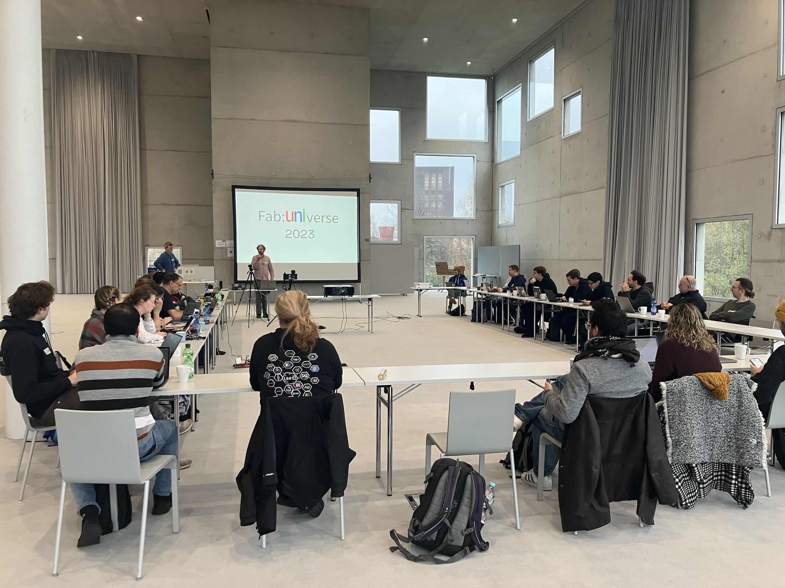
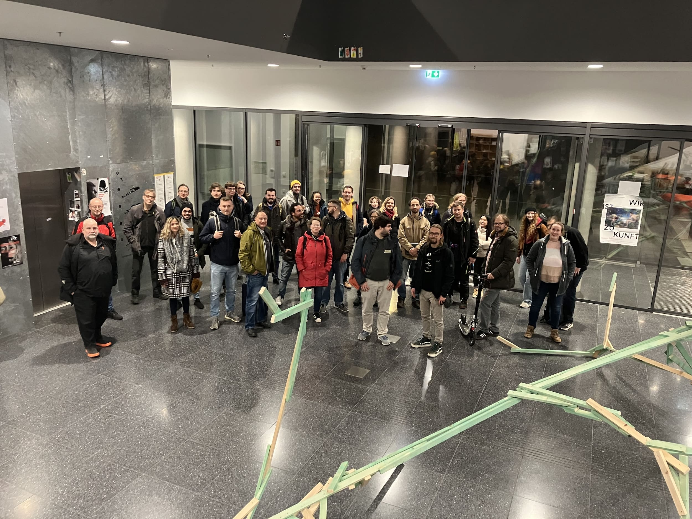

# 2023 in Essen

??? warning "Achtung! Veranstaltungsort kurzfristig von Bochum zu Essen geändert! Für mehr Informationen hier klicken."

    Die Fab:UNIverse 2023 findet nicht wie angekündigt an der Ruhr-Universität Bochum statt, sondern an der [Folkwang Universität der Künste](https://id.folkwang-uni.de/lehrgebiete/design-by-technology/) in Essen! Der Folkwang und insbesondere Prof. Stefan Neudecker sowie Daniel Wilkens gilt unser größter Dank für die absolut kurzfristige Zusage!  
	
    Hintergrund des kurzfristigen Ortswechsels: Die [Worldfactory der Ruhr-Universität Bochum](https://www.worldfactory.de/) hat am 13.11.2023 und 14.11.2023 ihre seit kurz nach der Fab:UNIverse 2022 bestehende Zusage zur Gastgeberschaft für die Fab:UNIverse 2023 zurückgezogen. Betroffen davon sind der Tagungsort im Makerspace der Ruhr-Universität Bochum, unterstützendes Personal, Catering-Kosten sowie zwei aus der RUB eingereichte und ebenfalls zurückgezogene [Workshops](#workshops).  

    Bestehende Anreise- und Hotelpläne können damit unverändert bleiben, denn der Campus der Folkwang ist nicht weit von Bochum entfernt und gut erreichbar. Der konkrete Veranstaltungsort wird das architektonische Meisterwerk des [SANAA-Gebäudes](https://www.folkwang-uni.de/home/hochschule/ueber-folkwang/campus/campus-zollverein-fachbereich-gestaltung/sanaa-gebaeude-zollverein) sein, in dem die Folkwang uns für die Tagung großzügige Flächen zur Verfügung stellt. 

    Die unmittelbare Umgebung bildet dabei das UNESCO-Welterbe [Zollverein](https://www.zollverein.de/) - einen besseren Einblick ins Ruhrgebiet und die dort gelebte Kultur und Transformation kann man sich eigentlich nicht wünschen. 

## Das war Fab:UNIverse 2023

{ width="49%" } 
{ width="49%" } 

Wir danken allen für eine tolle Veranstaltung! Die Dokumentation der Tagung wird in nächster Zeit an dieser Stelle weiter [ausgebaut](beitragen.md) werden. 

## Ankündigung

2023 wird Fab:UNIverse am **23. und 24. November** zu Gast beim Projekt [Sustainability by Design (SBYD)](https://www.instagram.com/sbyd.space/) an der [Folkwang Universität der Künste](https://www.folkwang-uni.de/) in Essen sein. Wie im letzten Jahr wird Fab:UNIverse zweitägig sein und der Fokus wird auf aktivem - aber letztlich spontanem und von den Teilnehmer\*Innen getriebenem - Austausch liegen. Zusätzlich gibt es die Möglichkeit, strukturiertere Beiträge einzureichen. Auch fürs Abend-Programm und das leibliche Wohl wird gesorgt sein. 

??? info "Mehr über die Folkwang Universität und das Projekt SBYD"

    Im vom BMBF und der Gemeinsamen Wissenschaftskonferenz geförderten Projekt [Sustainability by Design (SBYD)](https://www.instagram.com/sbyd.space/) entwickelt die [Fachgruppe Industrial Design](https://www.instagram.com/folkwang_id/) Transferstrategien und -formate im Kontext der Nachhaltigkeit. Darin sollen Erkenntnisse aus der Nachhaltigkeitsforschung mit Hilfe von Designmethoden in Zivilgesellschaft und Wirtschaft transferiert werden.
    
    Mit dem [Advanced Technology Lab](https://id.folkwang-uni.de/werkstatten/advanced-technology-lab/) (ATL) betreibt die Folkwang Universität ein bewusst an das Konzept der Fab Labs angelegtes Labor inmitten ihrer "regulären", disziplinär strukturierten [Werkstätten](https://id.folkwang-uni.de/werkstatten/).

## Call for Contributions

Die Fab:UNIverse ist keine klassische "Paper-Konferenz", sondern vor allem eine Möglichkeit zur Begegnung und zum Austausch. Trotzdem freuen wir uns natürlich über Beiträge, die für die Community von Interesse sind. [Workshops](#workshops), Vorträge, Tanzperformance - der Fantasie sind kaum Grenzen gesetzt. 

Wer etwas beitragen möchte, darf das natürlich auch in diesem Jahr sehr gerne tun! Input diesbezüglich bitte einfach an [Oliver Stickel](https://oliverstickel.de) schicken.

## Anmeldung

Bitte melde Dich für die Teilnahme an der Fab:UNIverse 2023 an. Wie immer ist die Tagung kostenlos. 

[Hier geht's zur Anmeldung](https://pretix.eu/fabuniverse/fabuniverse2023/){ .md-button }

## Programm

Hier findet ihr das (Rahmen-)Programm, das bis zur Tagung laufend mit neuen Beiträgen/Einreichungen ergänzt wird.

### 23.11.2023

**Ab 09:00 Uhr**		Eintreffen & Frühstück. Wir werden ganztägig Heiß-/Kaltgetränke, Milch(varianten), Müsli und ein wenig Obst bereitstellen. Weitere Mitbringsel sind gern gesehen.

**10:00 - 10:30 Uhr**   Begrüßung.

**10:30 - 13:00 Uhr**	Vorstellungsrunde und Impulsvorträge.

- Jeder Standort stellt sich kurz vor - Bilder / Medien / Artefakte / Mitbringsel optional, aber immer gern gesehen. Gerne (auch sehr kurzfristig) vorher an [info@fab-universe.de](mailto:info@fab-universe.de) schicken.
- Kurzvortrag zu einem Projekt zur gemeinschaftlichen Sammlung von Einstellungen / Presets an Maschinen. Referent\*Innen: Team der [Zentralen Werkstätten der Burg Giebichenstein Kunsthochschule Halle](https://www.burg-halle.de/hochschule/einrichtungen/zentrale-werkstaetten/).
- Live-Schaltung zum [Vulca Seminar 2023](https://vulca.eu/seminar23/) in Ljubljana mit Impulsvortrag zur Kooperation zwischen Fab:UNIverse und dem [Verbund offener Werkstätten](https://www.offene-werkstaetten.org/). Referent: [Maik Jähne](https://www.slub-dresden.de/ueber-uns/kontakte-und-ansprechpersonen/maik-jaehne).

**13:00 - 14:00 Uhr**	Pause und Mittagessen. Wahrscheinlich gehen wir gemeinsam als Selbstzahler\*Innen zu Öz Adana in der Gelsenkirchener Str. 255, 45327 Essen.

**14:00 - 16:30 Uhr**	Zeit für Vorträge, [Workshops](#workshops) und andere Einreichungen aus dem Call for Contributions (oder spontan).

**16:30 - open end**    Offener Austausch, Fachgespräche und Begehung der [Werkstätten](https://id.folkwang-uni.de/werkstatten/) der Folkwang Universität - und wahrscheinlich ein Cappu-Besuch im studentisch-autonomen Café am Campus Zollverein.

**Ab 18:30**            Gemeinsames Abendessen (Location noch in Klärung), Getränke und Ausklang.

### 24.11.2023

**08:30 - 09:30 Uhr**	Frühstück. Wir werden ganztägig Heiß-/Kaltgetränke, Milch(varianten), Müsli und ein wenig Obst bereitstellen. Weitere Mitbringsel sind gern gesehen.

**09:30 - 12:00 Uhr**	[Workshops](#workshops) und ggf. andere Einreichungen aus dem Call for Contributions.

**12:00 - 13:00 Uhr**	Wrap-up.

**Ab 13:00 Uhr**	Gemeinsames Mittagessen & Ausklang.

## Workshops

Die genaue Zeitplanung und Zuteilung zu den Workshops machen wir gemeinsam an Tag 1, zumal die Workshops unterschiedlich lange oder kurz brauchen werden. Der eine oder andere Workshop wird je nach Interessenslage der konkreten Teilehmer\*Innen wohl auch zusammengelegt werden. Wer möchte, kann natürlich im Vorfeld gern bereits in Kontakt zu den organisierenden Menschen treten.

### 23.11.2023

**Themenblock Infrastruktur**

**WS1:** Stand von und Hands-on mit [Fab Access](https://fab-access.org/). Organisation: [Das Team von RKLM](https://www.rlkm.berlin/).

**WS3:** *Special Interest Group Visicut:* Einführung in die quelloffene Steuer-Software für Lasercutter [*Visicut*](https://visicut.org/) sowie Arbeit an und Diskussion um die (Weiter-)Entwicklung des Projektes. Organisation: [Jan Borchers](https://hci.rwth-aachen.de/borchers), [Anke Brocker](https://hci.rwth-aachen.de/brocker) und [Maximilian Gaukler](https://www.offene-werkstaetten.org/users/profile/1076).

**Themenblock Bildung** 

**WS5:** Lehr- und Lernformate im Makerspace (insb. Sammlung von Methoden und Konzepten). Organisation: [Eva Ismer](https://www.th-wildau.de/personen/eva-ismer/).

**WS8:** Round Table: Fab Labs / Makerspaces und  MINT/STEAM. Organisation: [Marios Mouratidis](https://www.cscw.uni-siegen.de/team/marios-mouratidis/).

**WS9:** Fab Lab und Schule: Berichte aus der praxisnahen Forschung und Diskussion von Herausforderungen. Organisation: [Iris Bockermann](https://dimeb.informatik.uni-bremen.de/index.php?id=184).

### 24.11.2023

**Themenblock Infrastruktur**

<strike>**WS4:** Kunststoff-Recycling mit Wissen und Maschinen von [Precious Plastic](https://preciousplastic.com/). Organisation: [RUB-Worldfactory](https://www.worldfactory.de/).</strike>

**WS6:** Ein Website-Prototyp für Fab:UNIverse. Stand und Demo/Hands-on zur Bearbeitung. Organisation: [Tasso Mulzer](https://www.bht-berlin.de/people/detail/1487) und [Oliver Stickel](https://oliverstickel.de).

**Themenblock Organisationsentwicklung und Selbstreflexion**

<strike>**WS2:** Drittmittelanträge, Fundraising, Finanzierung. Organisation: [RUB-Worldfactory](https://www.worldfactory.de/).</strike>

**WS7:** Quo vadis, Fab:UNIverse? VOW-Arbeitsgruppe? Geschäftsstelle? Weiter wie bisher? Organisation: [Orga-Team Fab:UNIverse](https://fabuniverse.github.io/website/beitragen/).

**WS10:** Offenheit, Macht- und Hierarchiestrukturen in Fab Labs und Makerspaces. Organisation: [Oliver Stickel](https://oliverstickel.de).

## Kontakt und Organisation

Alle Anliegen zur übergeordneten Organisation und zum Programm von Fab:UNIverse 2023 bitte an [Oliver Stickel](https://oliverstickel.de) bzw. an [info@fab-universe.de](mailto:info@fab-universe.de).

## Übernachten

#### Camping

Das können wir direkt vor Ort leider nicht möglich machen - aber um die Ecke ist der [Wohnmobilstellplatz Nienhausen](https://nienhausen.de/index.php/revierpark/wohnmobilstellplatz).

#### Hotels

- Eine Anreise aus Bochum ist machbar, sodass Hotelreservierungen nicht unbedingt geändert werden müssen.
- In Reichweite gibt es zahlreiche Hotels - unter anderem direkt [auf Zollverein](https://www.zollverein.de/besuch-planen/essentrinken/designhotel-mit-bergbauatmosphaere/).

## Anreise und Umgebung

**Karten und mehr:**

- [Anfahrtsbeschreibung SANAA-Gebäude und Karten des Campus auf den Webseiten der Folkwang-Universität](https://www.folkwang-uni.de/home/hochschule/ueber-folkwang/campus/campus-zollverein-fachbereich-gestaltung/sanaa-gebaeude-zollverein#c139836)

- [Direkt-Link zum SANAA-Gebäude auf der interaktiven 3D-Karte der Stiftung Zollverein](https://www.zollverein.de/orientierungsplan/#/location/4ad79340-fe67-11ea-a0c4-23c06d3eeaab/51.4881082686326/7.047740135596655/70/-42/19)

- [Orientierung auf dem UNESCO-Welterbe Zollverein](https://www.zollverein.de/besuch-planen/gelaendeplan/)

**Anschrift:**  

Folkwang Universität der Künste | SANAA-Gebäude  
Gelsenkirchener Str. 209  
45309 Essen  

**Anreise:** 

- Es befinden sich mehrere Parkmöglichkeiten rund um das Gelände Zollverein. Die dem SANAA-Gebäude am nächsten gelegenen sind P A2 und P B (bei Schacht 1/2/8).
- Mit öffentlichen Verkehrsmitteln: 
    - Ab Essen Hbf mit der Straßenbahn Linie 107 in Richtung Gelsenkirchen Hbf bis zur Haltestelle Zollverein fahren - Fahrtzeit ca. 16 Min.
    - Aus Duisburg oder Dortmund mit S-Bahn-Linie 2 oder RE 3 bis Zollverein Nord. Von dort ist das Zollverein-Gelände fußläufig zu erreichen.
