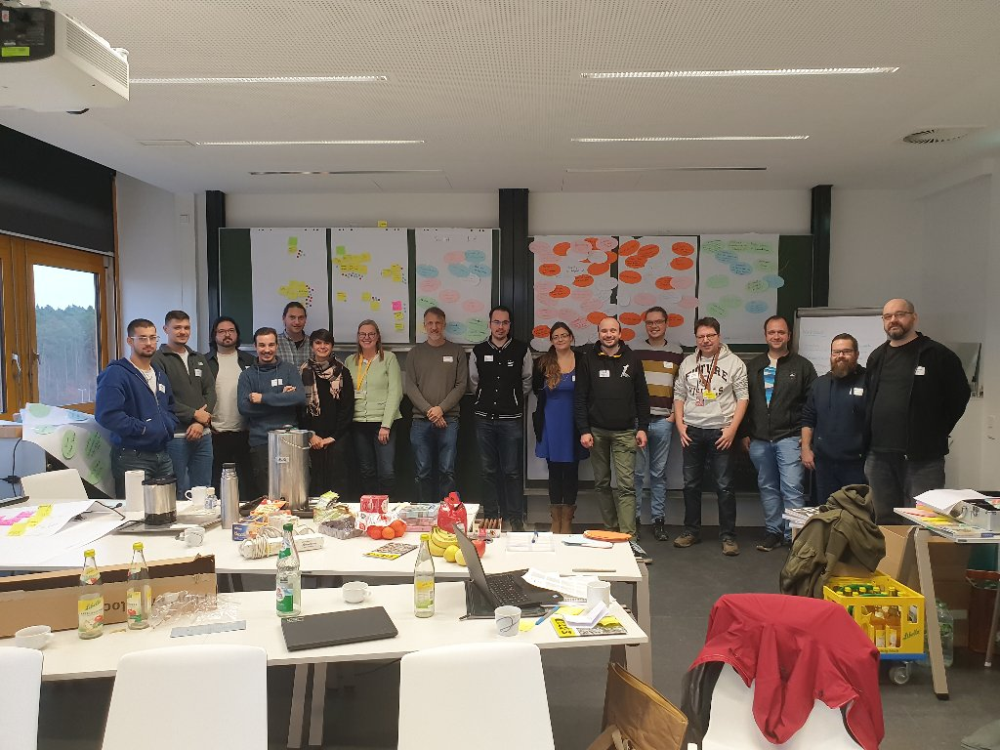
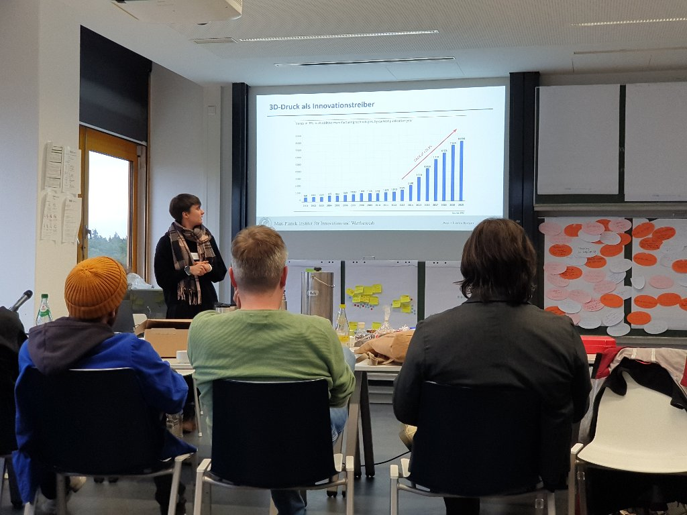
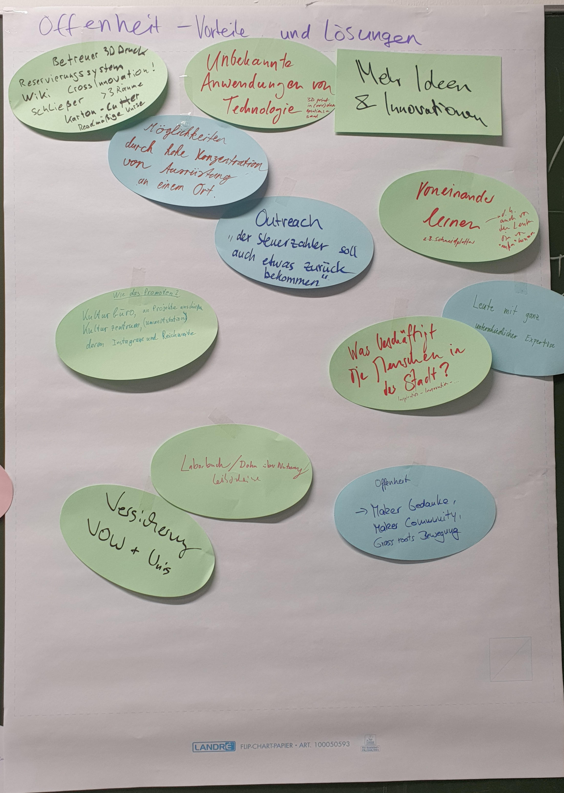
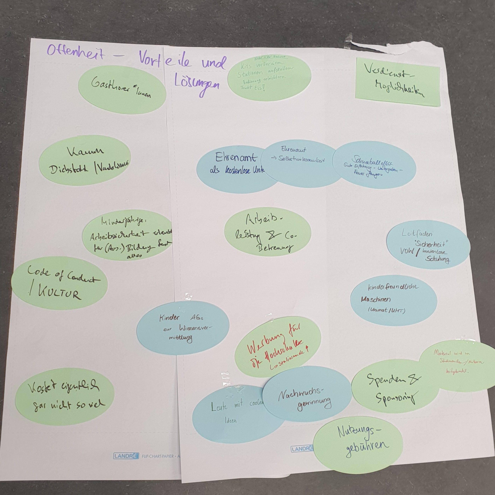
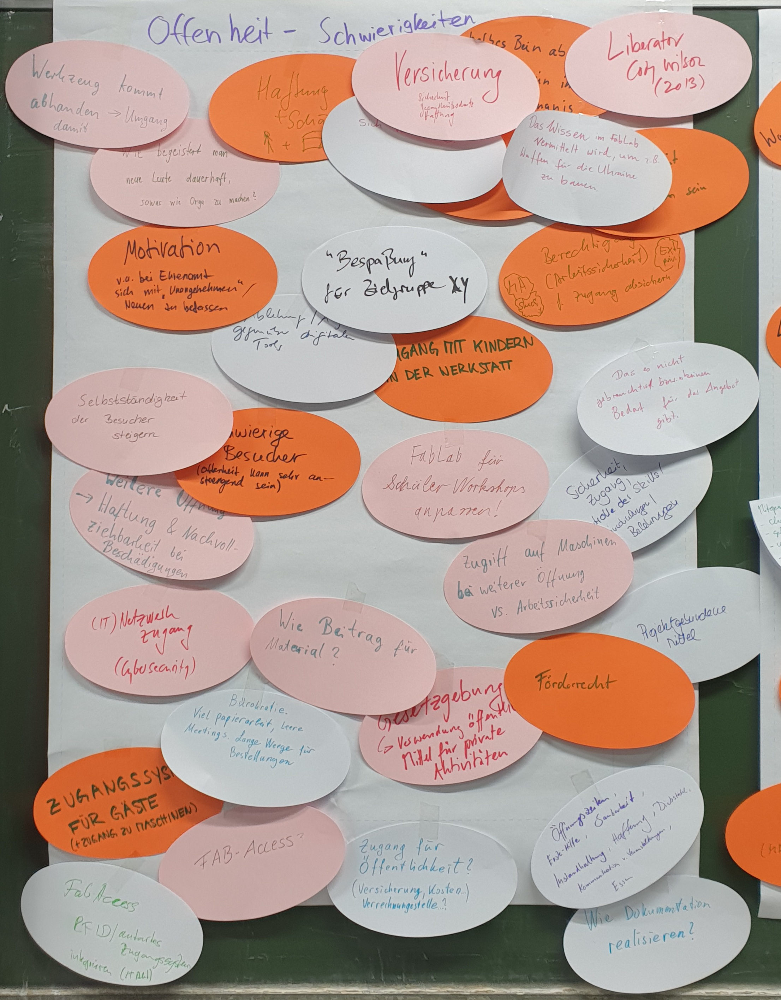
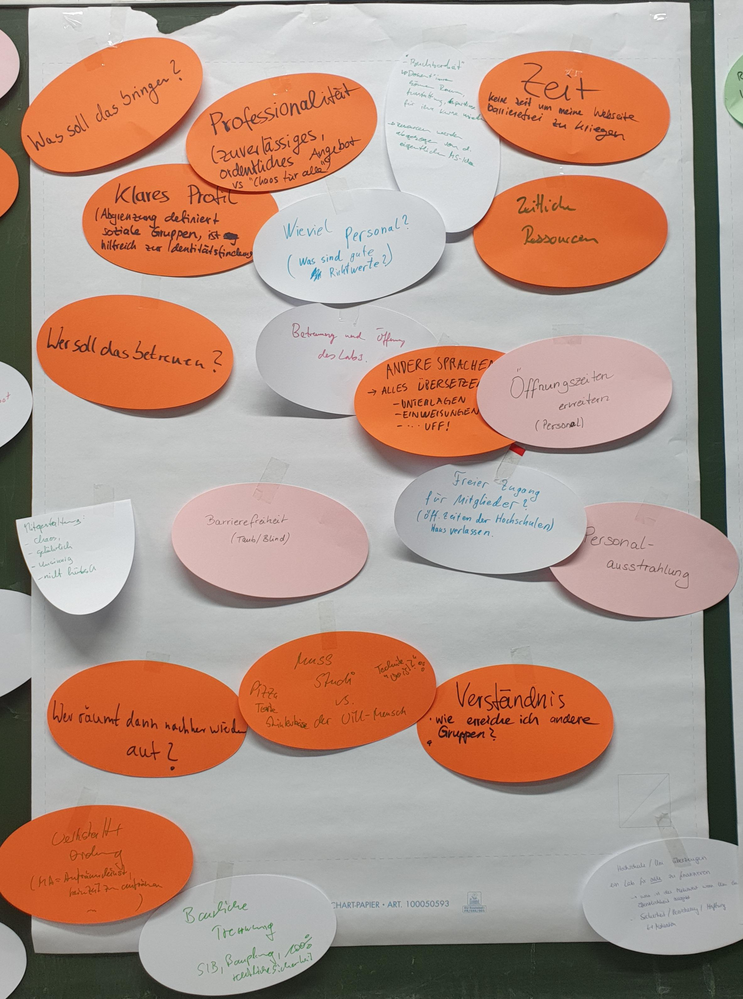
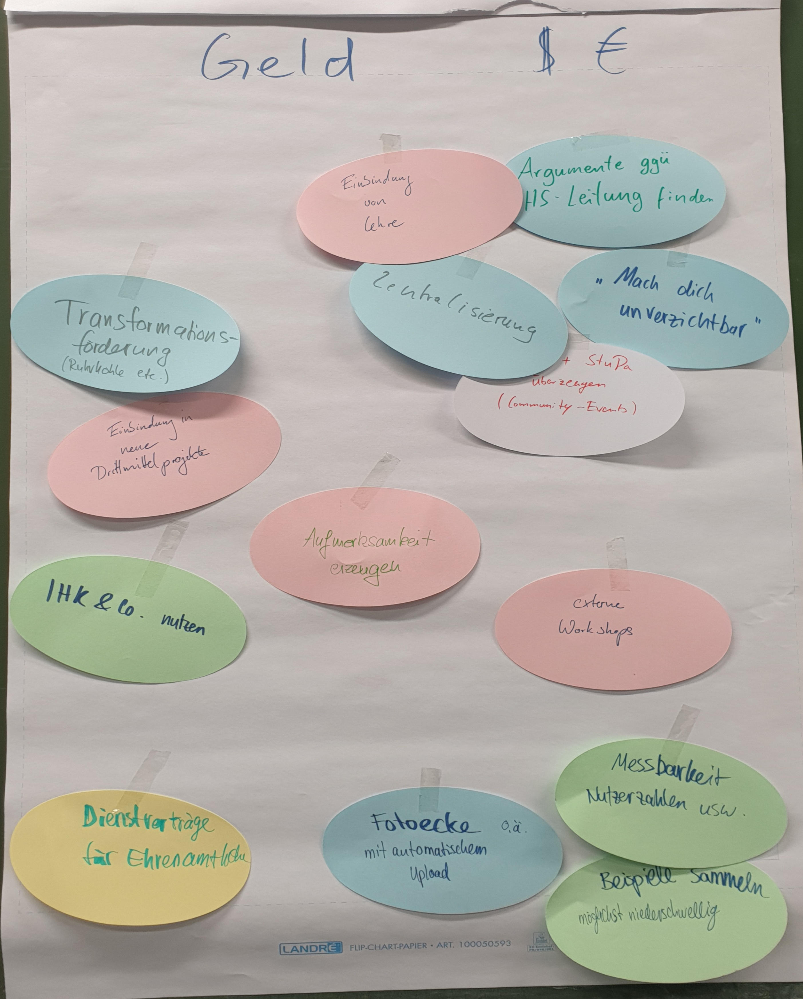
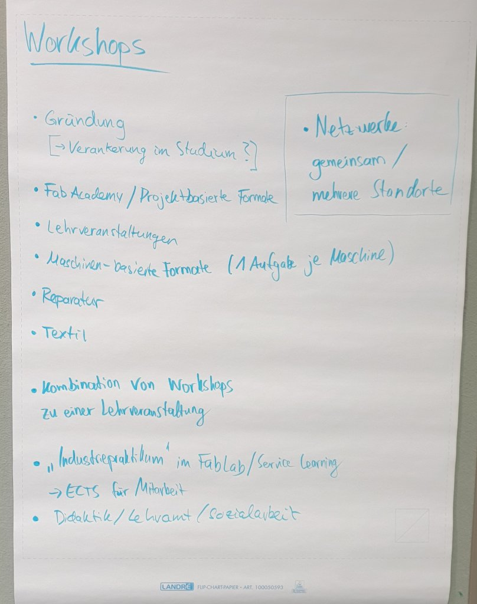

# 2024 in Erlangen

Die Fab:UNIverse 2024 fand an der [Friedrich-Alexander-Universität Erlangen-Nürnberg](https://www.fau.de/) statt. Gastgeber war das [FAU FabLab](https://fablab.fau.de/). Dabei waren 28 Teilnehmer von 15 veschiedenen Hochschul-Labs. In 2 Tagen wurden hunderte Ideen ausgetauscht und bei Lebkuchen und 13 Litern Kaffee neue Kontakte geknüpft. Wir danken dem Verbund offener Werkstätten für die finanzielle Unterstützung, und der FAU für die Infrastruktur.

## "Offen für ....."
Die diesjährige Fab:UNIverse steht unter dem Motto "offen für .....":
Werkstätten an Hochschulen gibt es viele, doch meist sind sie nur für eine Handvoll Menschen für ganz bestimmte Zwecke nutzbar. Mittlerweile gibt es jedoch auch immer mehr offenere Angebote, u.a. FabLabs und Makerspaces, mit dem Ziel dass mehr Personen die Möglichkeit haben ihre Ideen und Projekte umzusetzen. Doch was heißt "offen" genau und wie geht das? Jede Werkstatt hat dazu ihre eigenen Antworten und es gibt viel voneinander zu lernen.

Deshalb wollen wir uns als Betreiber solcher Angebote treffen und dazu austauschen, wie wir Angebote offener gestalten und neue Zielgruppen erreichen können. Aber auch die alltäglichen Themen im Betrieb einer Hochschul-Werkstatt sollen nicht zu kurz kommen.

## VULCA&VOW 2024
Die Fab:UNIverse 2024 findet als "Satellit" einer größeren Veranstaltung statt, des [VULCA Seminar & Jahrestreffen des Verbund offener Werkstätten (VOW)](https://www.zam.haus/projekt/vulca-vow-2024/). Beim gemeinsamen Abendprogramm am Mittwoch kommt ihr u.a. in Austausch mit Makern aus aller Welt aus dem Projekt VULCA. Wir empfehlen euch herzlich, nach der Fab:UNIverse (Mittwoch und Donnerstag) noch für die VULCA&VOW-Veranstaltung zu bleiben (bis Sonntag). Dort wird es voraussichtlich Workshops u.a. zur Anleitung und Einweisung geben (Wie erkläre ich gefährliche Maschinen? Wo finde ich vorhandene Inhalte von anderen Werkstätten?). Ihr trefft dort auch viele Betreiber von Werkstätten außerhalb von Unis.

## Programm

### Mi 20.11.24

**ab 13 Uhr** Eintreffen, Aufbau, Kaffee, erste Möglichkeit zur FabLab-Führung

**14:00 Uhr** Anfang der Konferenz

- 14:00 Begrüßung, Kennenlernen, Werkstatt-Vorstellungen
- 15:30 Offenheit - Teil 1: Bestandsaufnahme
  Lisa, Maik und Oli möchten gerne über die weitere Öffnung "offener" Werkstätten an Hochschulen berichten und diskutieren - nicht zuletzt im Zusammenhang mit Sicherheit und anderen Bedenken, denen man öfter begegnet. Es wird Beispiele aus Labs mit unterschiedlichen Öffnungsgraden geben. 
- 16:40 Organisatorisches zum Abendprogramm
- 16:45 Themenfindung für Donnerstag
- 17:15 Fahrt zum Abendessen
- 18:15 Abendessen gemeinsam mit internationalen Makern aus dem Projekt VULCA.
- **im Anschluss** Führung durch das ZAM Erlangen -- Makerspace und mehr auf demnächst sagenhaften 3.500 m².

### Do 21.11.24

**ab ca. 8:30 Uhr** Eintreffen, Aufbau, Kaffee

**09:00 Uhr** Anfang der Konferenz

- 9:00 Themenfindung
- 9:35 Vorträge
  - Forschung zu FabLabs als Innovationstreiber: 
    Ann-Christin Kreyer vom Max-Planck-Institut für Innovation und Wettbewerb untersucht derzeit die deutsche Fab Lab-Landschaft und stellt ihre Forschung und eine aktuelle Umfrage vor. 
  - Ein Reparier-Kiosk:
    Das Team *Sustainability by Design* der Folkwang-Universität stellt ihren [Repair-Kiosk](https://www.instagram.com/p/DBOI5Uut4BE/?hl=de&img_index=1) vor. 
  - Forschung zu FabLabs in der Hochschuldidaktik
  - Infos zum Verbund offener Werkstätten (VOW)
  - FabAccess
- 11:10 Mittagessen

**Mittagessen**

- 12:30 Offenheit - Strategien (Vortrag von Lisa Jacobi, BHT Berlin)
- 12:50 Geld: Austausch zu Förderung und weiteren Einkommensmöglichkeiten
- 13:30 FabLab-Führung, Vorführung der CNC-Fräse
- 14:30 Austausch zu Workshops, Community, Social Media, Kommunikation
- 15:30 Fab:UNIverse 2025

**16:00 Uhr** Ende der Konferenz

## Eindrücke

## Call for Contributions: Offen für deine Themen
Das Programm der Fab:UNIverse richtet sich ganz nach eurem Bedarf. Vieles ist möglich: Spontane Diskussions- und Austauschrunden, Workshops, Erfahrungsberichte, Vorträge (spontan oder vorbereitet), Vorführung von Software und vieles mehr. Mit begrenzter Teilnehmerzahl sind auch kleine Workshops im FabLab denkbar. Nur eines können wir ausschließen: Wir sind keine klassische Paper-Konferenz, d.h. es gibt keine Möglichkeit auf der Konferenz einen Artikel zu veröffentlichen. 

Was ist Dir wichtig? Möchtest Du vielleicht zu einem der folgenden Themen etwas beitragen? Oder etwas ganz anderes? Lass es uns wissen und schreibe uns an [info@fabuniverse.de](mailto:info@fabuniverse.de).

Wir würden uns *zum Beispiel* über Beiträge zu folgenden Themen freuen:

- Offen für den Tellerrand: Andere Institute und Fachgebiete erreichen
- Offen für deine Stadt: Personen außerhalb der Hochschule einbinden 
- Offen für (internationalen?) Austausch 
- Offen für Schulen
- Offen für Community: Ehrenamt und Freizeitspaß, passt das in meine Werkstatt? 
- Offen für alle? Inklusion, Barrierefreiheit und "Barrieren im Kopf"
- Offen für Zusammenarbeit: Open Source als Chance und Lernmöglichkeit
- Offen für ......

Wir freuen uns auf deine Rückmeldung und Ideen.

---

## Organisation und Kontakt

Rückmeldungen/-fragen jederzeit gerne per Email an [info@fabuniverse.de](mailto:info@fabuniverse.de).

